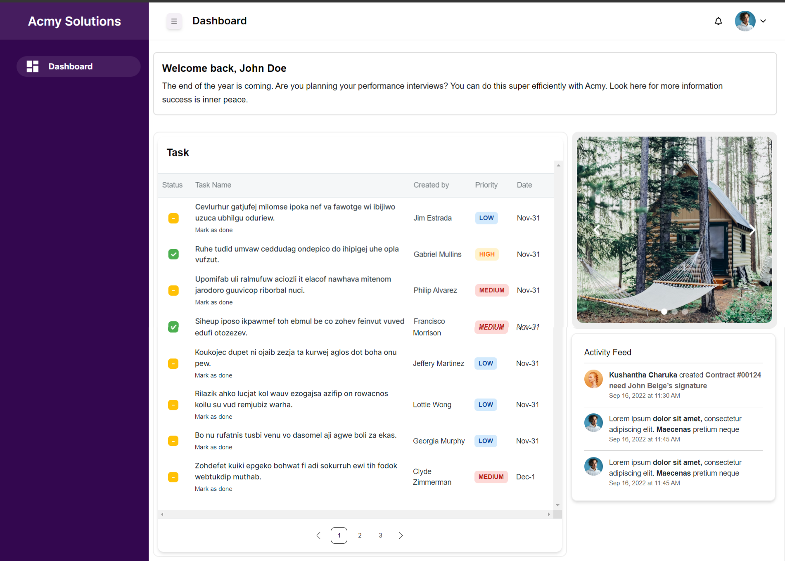

# Todo Dashboard App

This is a Todo Dashboard application built with Next.js and TypeScript. The app allows users to view tasks, track their completion status, and mark them as complete or incomplete. The user interface is built using Material-Tailwind.

## Deployment

The application is deployed on AWS Amplify. You can access it using the following link:

[Todo Dashboard App on AWS Amplify](https://your-amplify-app-url.amazonaws.com)



## Features

- View a list of tasks
- Track the completion status of each task
- Mark tasks as complete or incomplete
- Responsive design using Material-Tailwind

## Technologies Used

- [Next.js](https://nextjs.org/)
- [TypeScript](https://www.typescriptlang.org/)
- [Material-Tailwind](https://material-tailwind.com/)

## Installation

1. **Clone the repository:**

   ```bash
   git clone https://github.com/your-username/todo-dashboard-app.git
   cd todo-dashboard-app
   ```

2. **Install dependencies:**

   ```bash
   npm install
   ```

3. **Run the development server:**

   ```bash
   npm run dev
   ```

   Open [http://localhost:3000](http://localhost:3000) with your browser to see the result.

## Usage

1. **View Tasks:**

   - The main dashboard displays a list of tasks with their completion status.

2. **Mark Tasks as Complete/Incomplete:**
   - Click on the checkbox next to each task to mark it as complete or incomplete.

## Learn More

To learn more about Next.js, take a look at the following resources:

- [Next.js Documentation](https://nextjs.org/docs) - learn about Next.js features and API.
- [Learn Next.js](https://nextjs.org/learn) - an interactive Next.js tutorial.

You can check out [the Next.js GitHub repository](https://github.com/vercel/next.js/) - your feedback and contributions are welcome!

## Project Structure

```plaintext
/
├── components/           # React components
│   ├── Task.tsx          # Task component
│   ├── TaskList.tsx      # Task list component
├── pages/                # Next.js pages
│   ├── index.tsx         # Main dashboard page
├── styles/               # CSS and Tailwind styles
│   ├── globals.css       # Global styles
├── public/               # Public assets
├── types/                # TypeScript types
│   ├── task.d.ts         # Task type definition
├── utils/                # Utility functions
│   ├── api.ts            # API functions
├── .gitignore            # Git ignore file
├── package.json          # NPM package file
├── README.md             # Project README file
├── tailwind.config.js    # Tailwind CSS configuration
├── tsconfig.json         # TypeScript configuration
```

## Contributing

Contributions are welcome! Please fork the repository and create a pull request with your changes.

## License

This project is licensed under the MIT License. See the [LICENSE](LICENSE) file for more information.

## Acknowledgements

Thanks to the contributors of [Next.js](https://nextjs.org/), [TypeScript](https://www.typescriptlang.org/), and [Material-Tailwind](https://material-tailwind.com/) for their excellent tools and documentation.
